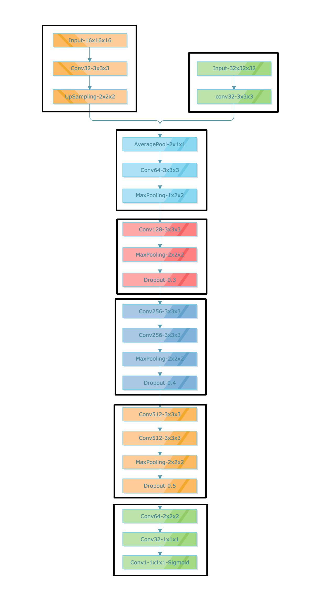

#天池医疗AI大赛[第一季]：肺部结节智能诊断总结
>小组成员：GuangQ(何光勤)，fly~(李飞燕)，默默j(贾玲慧)，LineZX(冯杰)
>最终名次：67名
>得分：0.452

*******
下面是比赛的网址，上面有对赛题的描述，我就不在重复
[比赛网址](https://tianchi.aliyun.com/competition/information.htm?spm=5176.100067.5678.2.4c5fd3br3tozC&raceId=231601)
ps：
由于本次比赛不准使用外部数据，对于我这种初次接触这种类型的比赛无疑是降低了难度

下面开始言归正传。

我们所做的方法是先利用深度学习的方法，从原始的CT图像中提取候选集。我们从600张训练集CT中提取了976个标记的肺结节后，对其进行随机平移(滑动步长较大，结节的中心不一定是所取区域的中心)，镜像处理(为了使其中心更加敏感)后，扩充了10倍的正样例训练集，然后在从600CT中取随机取10万的负样例，其中为了防止负样例没有信息(身体以外的区域)，筛选了部分负样例。
数据中有50%的肺结节直径在5-10mm，50%的肺结节直径在10-30mm。因此老师建议我们使用多尺度的方法，但是实际效果不太好，而且十分费时间。因此我想到了将多尺度整合进入网络的方法，就形成了下面的网络：
[]
对模型预测出来数据进行可视化后，我发现以下几点：
* 有很多点检测到肺部区域外
* 大量的点聚集在一起
* 有很多肺结节直径过小，而滑动步长过大(已经是所能容忍的最大时间了)，导致虽然检测出来有反应，但是滑块中心点未落到结节的半径内，所以当做了负例

对于第一点，想到的最直接的想法是去掉肺部以外的区域，但是发现1/3的结节是在肺部边缘或者血管上，所以这就很困难。但是后来发现在肺部以外区域的高概率点很少(只要阈值设得好，可以除去大量肺部以外的点)，所以这部分点我选择了忽视。
对于第二点，最常规的想法是聚类，但是那个如何确定点中心呢？因此我想到利用概率最大的那个点作为点的中心(因为观察数据后发现，检测出的正样本概率都很高)，来屏蔽掉周围直径为24mm(实验的来的)内的所有点，这样做屏蔽掉了大量的负样本，其中包括了大量肺部区域以外的点。
对于第三点，最直接的办法是，将屏蔽后的预测数据，在利用模型对其周围滑动步长空间的大小，进行一个一个像素的滑动，为了找到肺结节的中心，提高正样本被找到的概率，再对其进行屏蔽处理，筛去大量不需要的点(每个肺结节，只要点在其直径内，就算被找到，不重复计算)
~~以上是我做的部分~~

最后，在老师的建议利用医学特征来筛选肺结节，通过医学特征的svm在做最后一次筛选，这一步十分重要，这是我们从79名飞升到67名的关键步骤

[github上我的代码](https://github.com/12Clock/First_AI_of_medical_treatment_of_tianchi)
